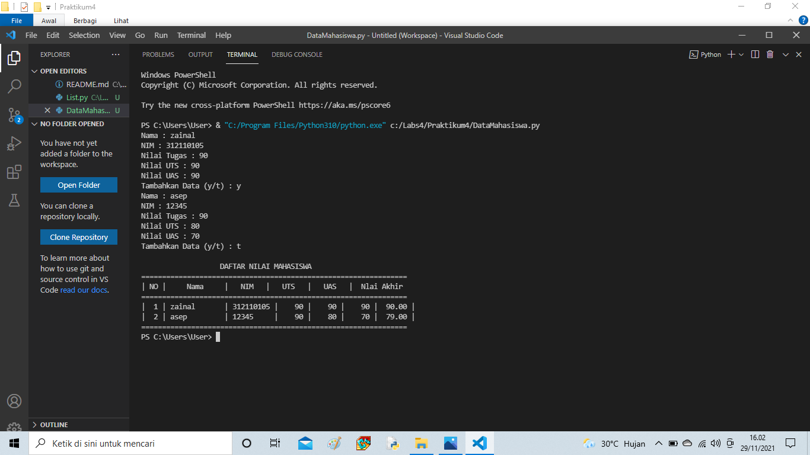

# Praktikum4

## Latihan 1

NAMA : ZAINAL ABIDIN
KELAS : TI.21.C1
NIM: 312110105

Latihan yang pertama adalah membuat daftar dengan menulis:

daftar = []
(keterangan: list dapat diubah dengan nilai lainnya misal list1, atau nama lainnya)

berikut penulisan dalam python:

dengan keterangan:

daftar = [ "a" , "b" , "c" , "d" , "e" ]

diatas adalah isi list nya

print ( "Tampilkan Elemen ke 3:" , daftar [ 2 ])

diatas adalah perintah untuk menampilkan elemen ke 3 dalam daftar, karena elemen ke 3 ada di indeks 2, maka didalam daftar pakai kurung siku [2]

print ( "ambil Element ke 2 sampai 4:" , list [ 1 : 4 ])

di atas untuk perintah untuk mengambil elemen ke 2 sampai ke 4 dengan elemen indeks ada di indeks 1 sampai 4

print ( "ambil elemen terakhir:" , list [ 5 - 1 ])list ada 5 elemen, maka digunakan -1 untuk mengambil elemen terakhir
mengubah elemen ke 4 dengan nilai lain

daftar [ 3 ] =  "f" 
sedangkan ini untuk mengubah elemen ke 4 dengan nilai F, karena elemen ke 4 ada di indeks 3, maka ditulis list[3]
print ( "merubah elemen ke 4 dengan nilai lain:" , list )
mengubah elemen ke 4 sampai terakhir

daftar [ 3 :] =  "f" , "g" 

ini untuk mengubah elemen ke 4 sampai terakhir dengan string "f" dan "g". maka ditulis daftar[3:]
print ( "merubah elemen ke 4 sampai elemen terakhir:" , list )

tambah daftar elemen
a = [ 1 , 2 , 3 , 4 , 5 ]
 b = [ 6 , 7 , 8 , 9 , 10 ]

di atas adalah untuk membuat 2 daftar
Ambil 2 bagian list A ke list B

b . append ( a [ 1 : 3 ])
 print ( " 2 bagian List A dijadikan List B : " , b )

diatas adalah kode untuk menambahkan list A kedalam list B dengan menggunakan perintah append
tambah daftar b dengan string

b . append ( "saya" )
 print ( "Tambah B dengan Sring:" , b )

diatas adalah untuk menambahkan list B dengan string menggunakan append
tambah daftar b dengan 3 nilai
mencetak ( "Tambah list b dengan 3 nilai:" , b + [ 11 , 12 , 13 ])

diatas adalah untuk menambahkan list b dengan 3 nilai dengan menggunakan aritmatika +
Daftar Gabungan B dan A

c = b + a 
print ( "Gabungan daftar B dan A:" , c )

dan berikut adalaha hasil perogramnya :

### Membuat nilai daftar mahasiswa 

berikut flowchartnya

Berukut perogramnya 

while perulangan :
    nama = input("Nama : ")
    nim = input("NIM : ")
    nilaiTugas = int(input("Nilai Tugas : "))
    nilaiUts = int(input("Nilai UTS : "))
    nilaiUas = int(input("Nilai UAS : "))
    nilaiAkhir = (nilaiTugas * 30/100) + (nilaiUts * 35/100) + (nilaiUas * 35/100)

    nilai.append([nama, nim, nilaiTugas, nilaiUts, nilaiUas, int(nilaiAkhir)])
    if (input("Tambahkan Data (y/t) : ")) == 't':
        perulangan = False

diatas adalah kode untuk memasukkan isi dalam daftar tersebut, juga untuk menambahkan daftar jika sudah menginput 1 nama atau nilai dalam daftar, dengan menggunakan append dan menggunakan variabel while

nilaiAkhir = (nilaiTugas * 30/100) + (nilaiUts * 35/100) + (nilaiUas * 35/100)

adalah kode untuk menghitung nilai di atas akhir dengan kondisi nilai akhir 30% dari tugas, ditambah 35% dari nilai UTS dan juga 35% dari nilai UAS, dengan kemudian diubah menjadi bentuk desimal, maka terdapat 0.30, 0.35. sedangkan untuk nilai_akhir.append adalah untuk menambahkan daftar dari yang telah di inputkan sebelum akhirnya ditampilkan

print("\n                   DAFTAR NILAI MAHASISWA                     ")
print("================================================================")
print("| NO |     Nama     |   NIM   |   UTS   |   UAS   |  Nlai Akhir ")
print("================================================================")

diatas untuk membuat border agar terlihat rapi

 print("| {no:2d} | {nama:12s} | {nim:9s} | {nilaiTugas:5d} | {nilaiUts:5d} | {nilaiUas:5d} | {nilaiAkhir:6.2f} |" .format(no=i, nama=item[0], nim=item[1], nilaiTugas=item[2], nilaiUts=item[3], nilaiUas=item[4], nilaiAkhir=item[5]))
print("================================================================")

sedangkan yang diatas adalah untuk menampilkan hasil dari list yang telah di inputkan, dengan menggunakan perulangan for n in range. dan berikut hasil dari code programnya 

